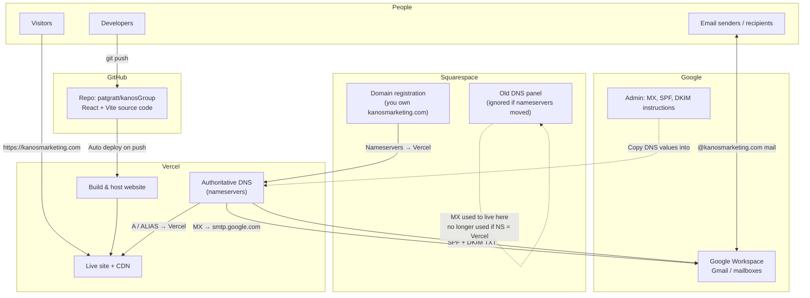
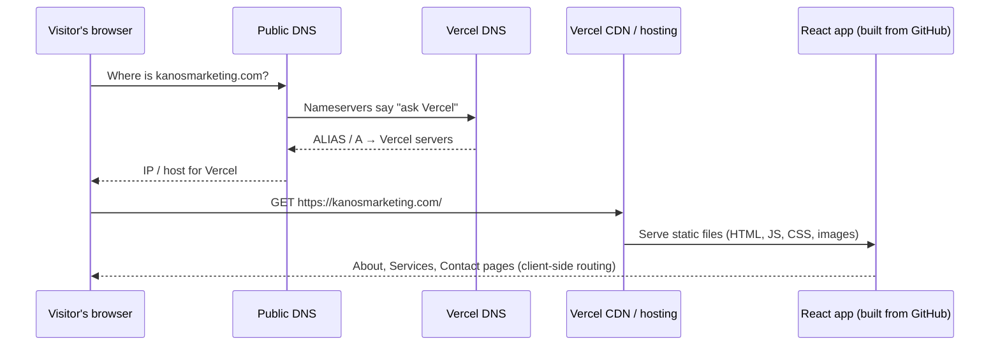
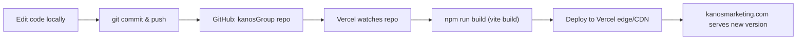
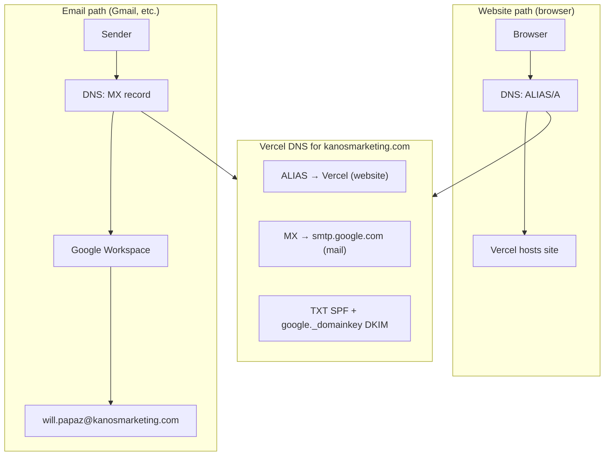
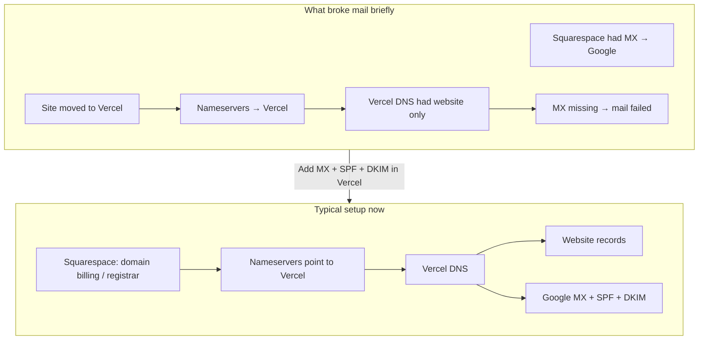

# Kanos Marketing — Website & Infrastructure Overview

How **kanosmarketing.com** connects Squarespace, GitHub, Vercel, and Google Workspace.

---

## 1. The whole picture (who does what)



**Summary:** Squarespace often **owns the domain**; **Vercel** runs the **site + live DNS**; **GitHub** holds the **code**; **Google** runs **email** (DNS in Vercel points mail at Google).

---

## 2. When someone opens the website



The app is a **Vite + React SPA**. `vercel.json` rewrites all routes to `index.html` so `/about`, `/services`, etc. work. Vercel serves **website files only** — not email.

---

## 3. When you change the site (dev → live)



**Flow:** push to GitHub → Vercel builds → new site live in minutes. Squarespace and Google are not involved in deploys.

---

## 4. Email (separate path from the website)



Mail **does not** go through Vercel's web servers. Vercel only **stores DNS records** that tell the world to send mail to **Google**.

---

## 5. Squarespace's role (before vs now)



Squarespace isn't hosting the React site if nameservers point to Vercel — it's mainly **domain registration** and possibly **legacy DNS**.

---

## 6. Simple boxes view

```
┌─────────────────────────────────────────────────────────────────┐
│  kanosmarketing.com (domain name)                                │
│  Registered / billed: often Squarespace                          │
│  Nameservers: Vercel                                             │
└─────────────────────────────────────────────────────────────────┘
         │                                    │
         │ DNS (website)                      │ DNS (email)
         ▼                                    ▼
┌─────────────────────┐              ┌─────────────────────┐
│  VERCEL             │              │  GOOGLE WORKSPACE    │
│  • Builds from      │              │  • Inboxes           │
│    GitHub repo      │              │  • Send/receive      │
│  • Serves React     │              │  • will.papaz@…      │
│    marketing site   │              │                      │
└─────────────────────┘              └─────────────────────┘
         ▲
         │ git push
┌─────────────────────┐
│  GITHUB             │
│  patgratt/kanosGroup│
│  Source code        │
└─────────────────────┘
```

---

## Quick reference

| Service | Role |
|--------|------|
| **Squarespace** | Domain registration (and possibly old DNS); not serving the site if NS → Vercel |
| **GitHub** | Source code (`patgratt/kanosGroup`); triggers Vercel deploys |
| **Vercel** | Builds & hosts website; **authoritative DNS** (site + Google mail records) |
| **Google** | Email only (Workspace); mailboxes like `will.papaz@kanosmarketing.com` |
| **Visitors** | Hit Vercel for the site; never touch Google for browsing |

---

## Required DNS records (Vercel)

| Record | Name | Purpose |
|--------|------|---------|
| **ALIAS / A** | `@` (empty) | Website → Vercel |
| **MX** | `@` (empty) | Mail → `smtp.google.com` (priority 1) |
| **TXT (SPF)** | `@` (empty) | `v=spf1 include:_spf.google.com ~all` |
| **TXT (DKIM)** | `google._domainkey` | Google signing key from Admin console |

Optional: **DMARC** at `_dmarc` when Google recommends it.
